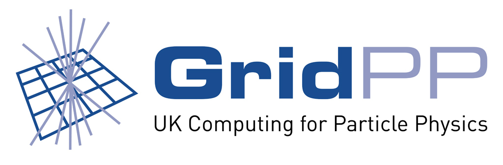
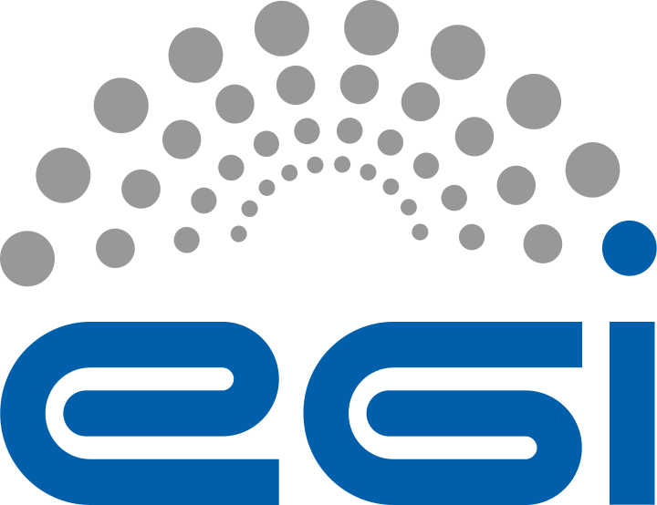
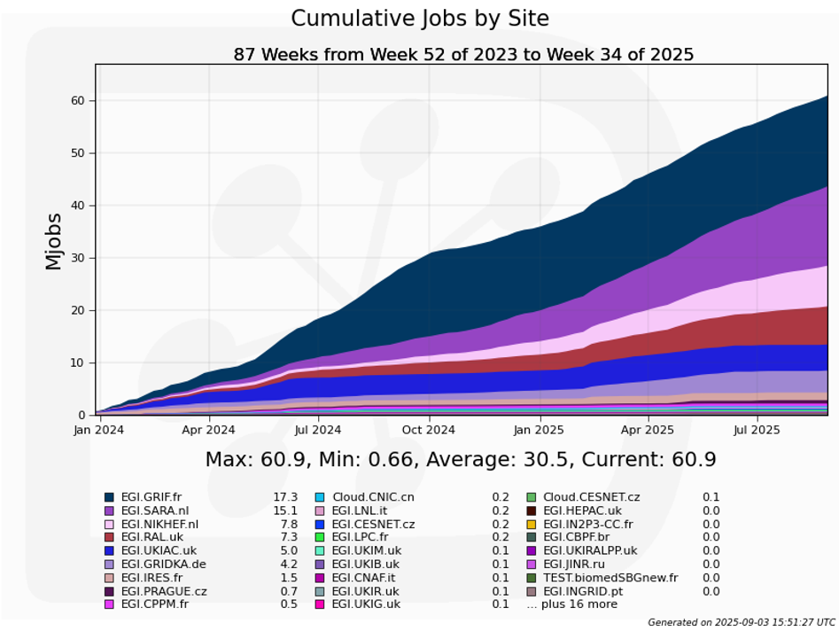

The DIRAC software and services are used by multiple scientific experiments and research groups in the world.

**The page is under construction**

##LHCb

##Belle II

##CTAO

##JUNO

##GridPP

{ align=right width="100" }

[GridPP](https://www.gridpp.ac.uk/) is a collaboration of 15 UK universities, plus Rutherford Appleton Laboratory (RAL) that operates the UK Grid infrastructure. It is part of the [WLCG](https://wlcg.web.cern.ch/) and its focus is on particle physics, neutrino, and adjacent experiments. GridPP maintains the [GridPP DIRAC server](https://dirac.gridpp.ac.uk) as the entrypoint to grid (compute and storage) and cloud resources for a number of scientific communities with UK participation. Further information on the GridPP specific implementation of DIRAC can be found here: [GridPP documentation](https://github.com/ic-hep/gridpp-dirac-users/wiki). If you think your community would benefit from using the GridPP DIRAC instance, please don't hesitate to [contact us](https://www.gridpp.ac.uk/contact/).

##EGI

{ align=right width="100" }

[EGI](https://www.egi.eu) is a European Grid Infrastructure operating a federation of computing resources and service providers for multiple scientific communities in Europe and in the world.

{ align=left width="250" }

One of the services offered by EGI is the [Workload Manager](https://www.egi.eu/service/workload-manager/) which is a DIRAC service. It provides both workload and data management components allowing users to execute jobs in the EGI sites as well as manage their distributed data. The [EGI Workload Manager](https://dirac.egi.eu) is serving about 20 scientific communities from various scientific domains, some of them counting more than thousand users. The service is hosted on the premises of the [IN2P3 Computing Center, Lyon](https://cc.in2p3.fr/en/) and is operated by a team of administrators from several CNRS laboratories. In 2024, more than 30 millions user jobs were executed with the help of the EGI Workload Manager service.   
